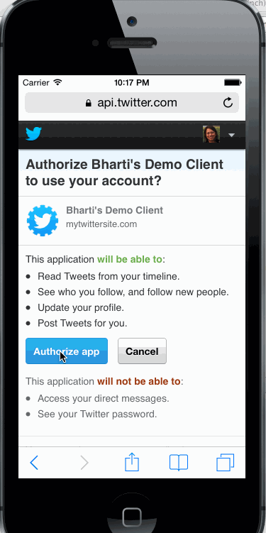

twitterapp
==========

Overview: Build a simple Twitter client that supports viewing a Twitter timeline and composing a new tweet.

Hours: 10

User Stories completed:
- User can sign in using OAuth login flow
- User can view last 20 tweets from their home timeline
- The current signed in user will be persisted across restarts
- In the home timeline, user can view tweet with the user profile picture, username, tweet text, and timestamp.  In other words, design the custom cell with the proper Auto Layout settings.  You will also need to augment the model classes.
- User can pull to refresh
- User can tap on a tweet to view it, with controls to retweet, favorite, and reply.

Week 5 stories completed
- Cleaned up the exception I got last week
- Created a container view with sub views. Add the hamburger menu icon.

